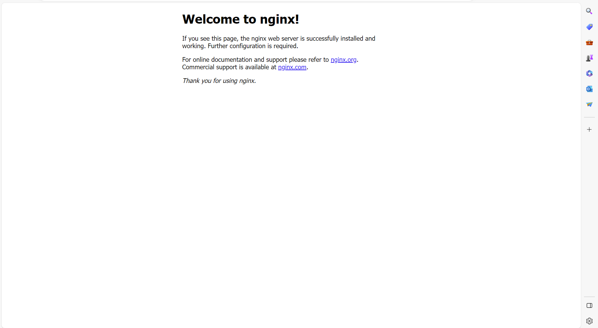
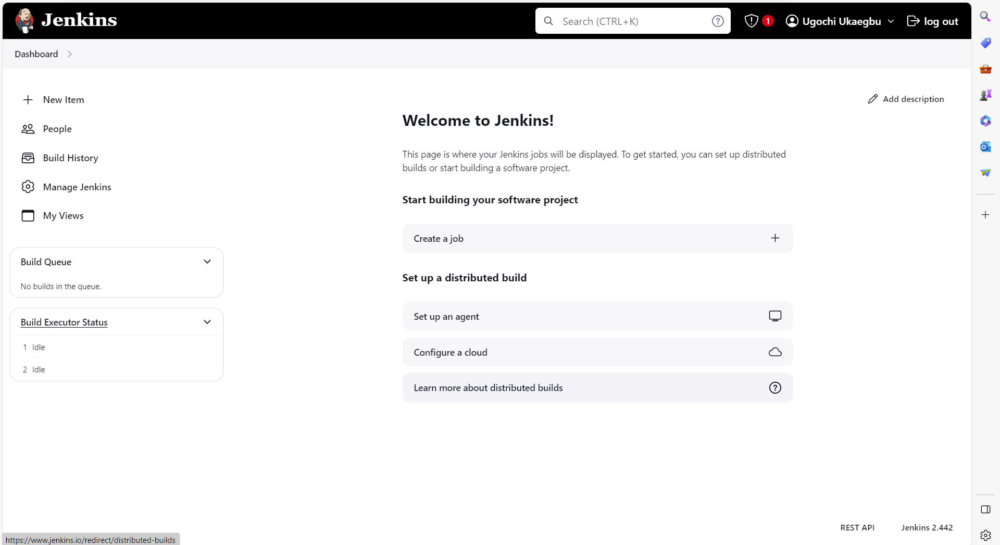

# ANSIBLE-DOCKER EXECUTION

This is just a simple playbook used to pull docker images and create containers from the image.

## STEP 1: PULL
The first section of the playbook is focused on pulling the latest docker image of nginx, postgressql and jenkins.

## STEP 2: RUN
The second step of the playbook creates a docker container from the images pulled. The port of the docker host and the docker container was mapped so that it can be accessed from a web browser.

## HOW TO CHECK YOUR IMAGES AND CONTAINERS?
There are two ways to check if your containers were created:
- Docker Desktop User Interface(UI)
- On the terminal.

**To check on the terminal, use the following commands:**

      - To see the docker images you pulled use `docker images`
      - To see the docker containers created use `docker ps`
      - To see all containers(both running and stopped) use `docker ps -a`

### Image of the nginx server

### Image of Jenkins server

